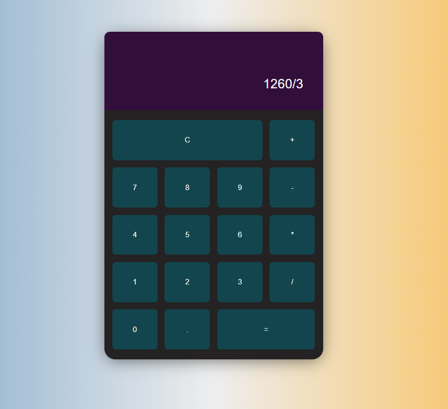

# Project - JavaScript calculator
This calculator supports basic arithmetic
calculations on integers. 

## Using
- HTML
- CSS
- JavaScript - (NOT using eval() or function()).

## Logic

-   [ ] User can see a display showing the current number entered or the
result of the last operation.
-   [ ] User can see an entry pad containing buttons for the digits 0-9, 
operations - '+', '-', '/', '=' and a 'C' button (for Clear All).

## Screenshot

## Future updates and current limitations

-   Use Keyboard for input method.
-   Percentage calculations
-   Delete button: clear last input.
